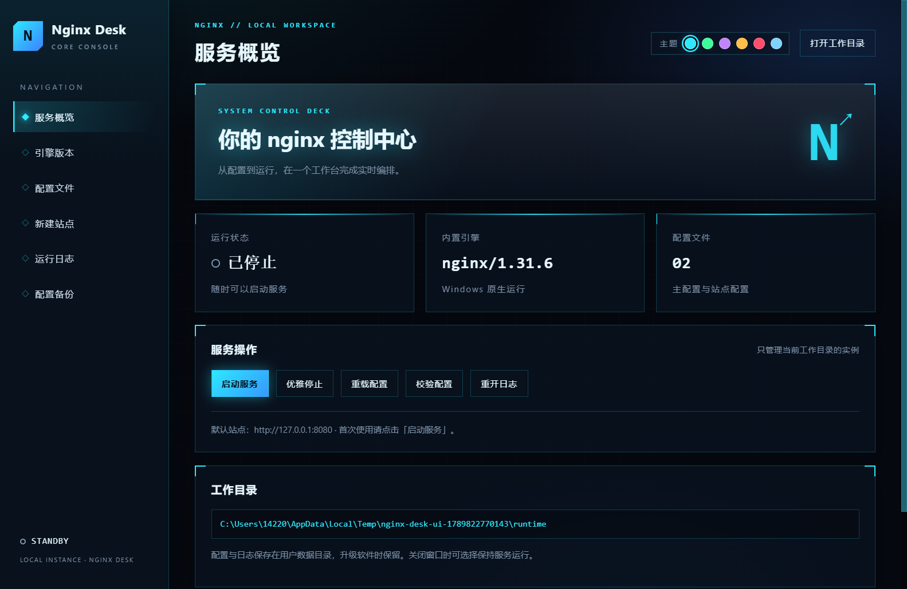

# Nginx Desk

中文 Windows 桌面 nginx 管理器，基于 Electron，安装包内置官方 nginx 1.31.6，无需用户另装 nginx、Node.js 或配置环境变量。



项目代码采用 [MIT License](LICENSE)。打包的 nginx 保留其原始许可证，位于安装目录 `resources/nginx/docs/LICENSE`。

Windows 安装程序可从 [GitHub Releases](https://github.com/cuijiying/NginxDesk/releases/latest) 下载。安装程序尚未签名，附带 SHA256 校验文件。

## 功能

- 实例状态、版本、PID；启动、优雅停止、配置校验、重载、日志重新打开。
- 从官方 Windows 版本列表下载、启用或删除指定 nginx；切换或删除前请先停止服务，正在使用的版本不能删除，现有配置会保留。
- 主配置和站点配置编辑；保存自动备份，真实 nginx 校验失败自动回滚。
- 静态站点 / HTTP 与 HTTPS 上游反向代理配置生成、预览和保存。
- 错误日志与访问日志尾部查看、自动刷新；历史配置载入并恢复。
- 深色科幻控制台界面，可在极光青、矩阵绿、量子紫、战术金、脉冲红、寒冰蓝之间切换主题。
- 单实例应用；关闭时选择停止 nginx 或继续后台运行。
- NSIS 安装向导、安装目录选择、桌面快捷方式；配置保存在用户数据目录。

## 开发与打包

Windows 10/11 x64，Node.js 22.12 或更高：

```powershell
npm ci
npm run prepare:nginx
npm test
npm run test:ui
npm start
npm run dist
```

安装程序输出：`dist/Nginx Desk Setup 1.0.0.exe`。构建首次需要联网下载 Electron、打包工具和 nginx。nginx 下载地址与 SHA256 固定在 `scripts/prepare-nginx.ps1`；升级时同时审查并更新版本和摘要。

## 使用

1. 安装后打开软件，点击「启动服务」，访问 http://127.0.0.1:8080。
2. 在「配置文件」编辑配置，点击「校验并保存」，再点击「重载配置」。
3. 「新建站点」填写参数后生成预览，保存并重载。新建站点默认监听所有网络接口。
4. 「运行日志」查看错误信息；「配置备份」选择历史内容载入编辑器，保存并重载即可恢复。
5. 「引擎版本」查看 nginx.org 的 Windows 发行列表，停止服务后可安装、启用或删除指定版本。正在使用的版本不能删除。

配置目录：`%APPDATA%/nginx-desk/runtime`（实际位置以界面为准）。下载的 nginx 引擎缓存在 `%APPDATA%/nginx-desk/engines`。软件升级与卸载默认保留用户数据。主配置必须保留 `pid logs/nginx.pid;`，日志页读取 `logs/error.log` 与 `logs/access.log`。可编辑完整 nginx 配置来设置 TLS、上游负载均衡、缓存等；这些高级项目目前没有专用表单。不要在运行期间从外部修改 PID 路径。

## 范围与限制

- 这是当前用户运行的桌面管理软件，不是 Windows 系统服务；没有开机自动启动、证书自动申请或多实例管理。
- 官方 Windows nginx 被标为 beta，并有性能及功能限制；高并发生产部署请先评估官方说明：https://nginx.org/en/docs/windows.html 。
- 应用安装包尚未进行代码签名，Windows 可能显示未知发布者提示。
- 仅管理软件自己的实例，不接管已有 nginx。端口占用会报告启动错误，不会结束其他程序。
- 保存校验使用 `nginx -t` 检查磁盘配置；重载提交信号后可通过错误日志确认工作进程是否采用新配置。
- 备份保留完整配置，可能包含敏感参数，请使用系统权限保护用户数据目录；备份当前不自动清理。
- 引擎版本仅安装 nginx.org 官方 Windows 列表中的发行包；下载使用 HTTPS，切换前必须停止当前实例。正在使用的版本不能从本地缓存删除。

## 结构

`src/manager.cjs` 负责 nginx 与配置事务，`src/main.cjs` 负责桌面窗口和受限 IPC，`src/preload.cjs` 暴露固定接口，`src/renderer.js` / HTML / CSS 实现界面。渲染进程禁用 Node.js，开启 context isolation、sandbox 和 CSP。

`test/manager.test.cjs` 包含输入约束测试，以及真实 nginx 的启动、HTTP 响应、配置回滚、备份、重载、停止与版本切换约束集成测试；使用隔离临时目录和动态端口。

`npm run test:ui` 在临时用户配置下启动真实 Electron 窗口，验证 preload、IPC、配置读取、导航和站点生成，并保存本地测试截图 `artifacts/desktop-smoke.png`。

nginx 官方发行包的许可保存在安装目录 `resources/nginx/docs/LICENSE` 中。

## 开发者文档

完整架构、技术栈、源码导读、调试、测试、打包与排错见 [docs/README.md](docs/README.md)。适合第一次参与维护的开发者按顺序阅读。
